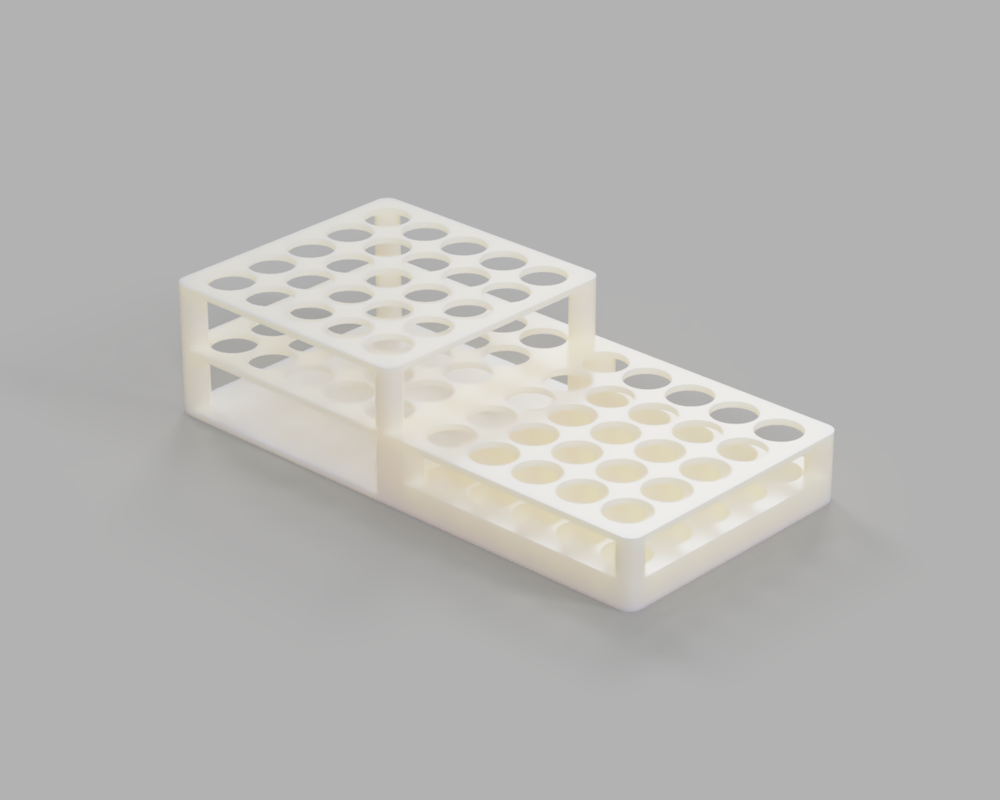

# Tube Rack for Serum/Plasma Transfer

## Description

This project is a specially designed tube rack aimed at facilitating the transfer of serum and plasma from centrifuged blood collection tubes to smaller serum/plasma collection tubes used in centralized laboratories for clinical trials.

The rack can hold **25 blood collection tubes** (e.g., "Vacutainer") and **25 smaller serum/plasma collection tubes**, thanks to its two-level design. The upper level is for the larger tubes, and the lower level is designed to support smaller tubes used for serum/plasma collection.

The system is 3D-printable, with **three parts** that can be assembled with a **press-fit** mechanism, avoiding the need for screws. The recommended 3D printing settings are:
- **2-3 outer layers**
- **15% infill** for strength and minimal material use
- Material: **PLA**

## Assembly

1. Print all three parts with the recommended settings.
2. Assemble by pressing the pieces together, starting with the base.
3. No screws or adhesives are needed due to the press-fit design.

## Usage

- The rack holds centrifuged blood collection tubes on the upper level and smaller serum/plasma collection tubes on the lower level. This setup allows for easy transfer of fluids during clinical trials and lab processing.

## License

This project is licensed under the MIT License. See the [LICENSE](./LICENSE) file for details.
